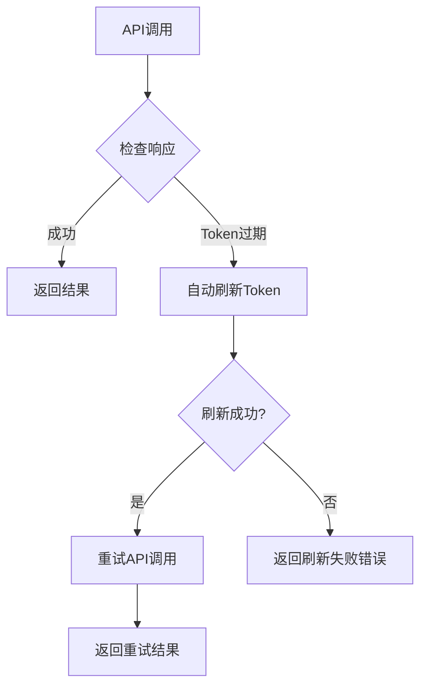

# Token自动刷新功能使用指南

## 概述

本MCP服务器现在支持**智能token自动刷新**功能，当API调用返回token过期错误时，系统会自动获取新的token并重试请求，确保您的工作流程不会因为token过期而中断。

## 功能特性

### 🔄 自动刷新机制
- **智能检测**: 自动识别各种token过期错误格式
- **自动重试**: token刷新成功后自动重试原始请求
- **无缝衔接**: 整个过程对用户透明，无需手动干预

### 🛠️ 手动刷新工具
- **refresh_token_auto**: 一键刷新token，使用预设认证信息
- **get_oauth_token**: 完整的OAuth token获取工具
- **refresh_intranet_token**: 传统的token刷新方式

### 📊 智能监控
- **执行时间监控**: 记录API调用和token刷新的耗时
- **详细日志**: 完整的token刷新过程日志
- **状态追踪**: 实时显示token刷新进度

## 预设认证信息

根据您提供的成功调试参数，系统已配置以下默认认证信息：

```json
{
    "username": "edu_admin",
    "password": "123456",
    "client_id": "test",
    "client_secret": "123456",
    "scopes": "web",
    "grant_type": "password"
}
```

## 使用方法

### 1. 自动刷新（推荐）

系统会在以下情况自动刷新token：
- API返回HTTP 401状态码
- 错误消息包含"token"、"unauthorized"、"expired"等关键词
- 业务错误码为401、40001、40002、**40003**等
- 错误消息包含"token过期"、"无效token"、"token异常"等中文关键词

**无需任何操作，系统自动处理！**

### 2. 手动刷新token

当您需要主动刷新token时：

```python
# 使用MCP工具调用
await refresh_token_auto()
```

### 3. 自定义认证信息

如果需要使用不同的认证信息：

```python
await get_oauth_token(
    username="your_username",
    password="your_password",
    client_id="your_client_id",
    client_secret="your_client_secret"
)
```

## 支持的API调用

以下工具已集成自动token刷新功能：

### 地形分析工具
- ✅ `coverage_aspect_analysis` - 坡向分析
- ✅ `coverage_slope_analysis` - 坡度分析
- ✅ `terrain_analysis_suite` - 地形分析套件

### 空间分析工具
- ✅ `spatial_intersection` - 空间相交分析

### DAG批处理工具
- ✅ `execute_code_to_dag` - 代码转DAG任务
- ✅ `submit_batch_task` - 提交批处理任务
- ✅ `execute_dag_workflow` - 完整DAG工作流

## Token过期检测逻辑

系统会检测以下类型的token过期响应：

### HTTP状态码检测
```json
{
    "status_code": 401,
    "error": "Unauthorized"
}
```

### 错误消息检测
```json
{
    "error": "Token expired, please refresh"
}
```

### 业务错误码检测
```json
{
    "code": 401,
    "msg": "Token无效"
}
```

### 您的API具体错误格式
```json
{
    "code": 40003,
    "msg": "token过期或异常",
    "data": null
}
```

```json
{
    "code": 40003,
    "msg": "无效token"
}
```

## 工作流程



## 日志监控

系统提供详细的日志记录：

### API调用日志
```
2024-01-15 10:30:15 - shandong_api - INFO - API调用成功 - URL: http://172.20.70.142:16555/gateway/computation-api/process - 耗时: 2.3456s
```

### Token刷新日志
```
2024-01-15 10:30:20 - shandong_api - INFO - 检测到token过期，尝试自动刷新token...
2024-01-15 10:30:22 - shandong_api - INFO - 自动token刷新成功
2024-01-15 10:30:22 - shandong_api - INFO - token刷新成功，重试API调用...
```

## 配置参数

### Token API配置
```python
# OAuth Token获取地址
TOKEN_URL = "http://172.20.70.141/api/oauth/token"

# 默认认证参数
DEFAULT_AUTH_PARAMS = {
    "username": "edu_admin",
    "password": "123456",
    "client_id": "test", 
    "client_secret": "123456",
    "scopes": "web",
    "grant_type": "password"
}
```

### API超时配置
```python
# API调用超时时间
API_TIMEOUT = 120  # 秒

# Token刷新超时时间  
TOKEN_REFRESH_TIMEOUT = 30  # 秒
```

## 测试验证

运行测试脚本验证token自动刷新功能：

```bash
python test_token_auto_refresh.py
```

测试覆盖以下场景：
1. ✅ OAuth Token获取
2. ✅ 自动Token刷新
3. ✅ Token过期检测逻辑
4. ✅ 自动刷新API调用
5. ✅ 后台自动刷新

## 错误处理

### 常见错误及解决方案

#### 1. 网络连接错误
```
错误: Connection timeout
解决: 检查网络连接，确认API地址可访问
```

#### 2. 认证信息错误
```
错误: Authentication failed
解决: 检查用户名、密码是否正确
```

#### 3. Token格式错误
```
错误: Invalid token format
解决: 检查token是否包含"Bearer "前缀
```

## 最佳实践

### 1. 监控Token有效期
定期检查token的有效期，避免在关键操作时过期：

```python
# 检查当前token状态
result = await refresh_token_auto()
data = json.loads(result).get("data", {})
expires_in = data.get("expires_in", 0)
print(f"Token剩余有效期: {expires_in}秒")
```

### 2. 批量操作前预刷新
在执行大量API调用前，主动刷新token：

```python
# 预刷新token
await refresh_token_auto()

# 执行批量操作
for task in tasks:
    await execute_task(task)
```

### 3. 异常处理
为关键业务添加额外的错误处理：

```python
try:
    result = await api_call()
except Exception as e:
    if "token" in str(e).lower():
        # 手动刷新token并重试
        await refresh_token_auto()
        result = await api_call()
    else:
        raise e
```

## 性能优化

### 1. 减少不必要的刷新
- 系统会缓存有效的token，避免频繁刷新
- 只有检测到真正的token过期才会触发刷新

### 2. 并发控制
- 多个并发API调用共享同一个token刷新过程
- 避免同时发起多个token刷新请求

### 3. 快速失败
- 如果token刷新连续失败，系统会快速返回错误
- 避免无效的重试循环

## 支持的服务

### 当前支持的API服务
- ✅ OGE API (`http://172.30.22.116:16555`)
- ✅ 内网API (`http://172.20.70.142:16555`)  
- ✅ DAG API (`http://172.20.70.141/api/oge-dag-22`)

### 未来计划支持
- 🔄 更多地理信息API
- 🔄 第三方数据源API
- 🔄 云存储API

---

**现在您可以放心使用所有API功能，不用担心token过期的问题！系统会自动处理一切。** 🎉 